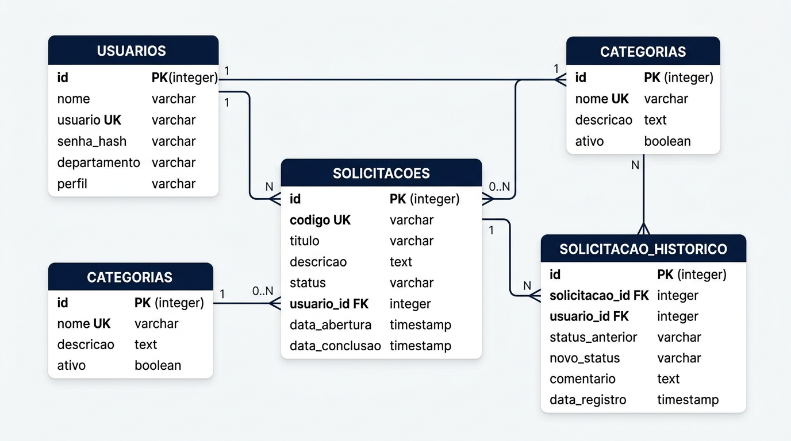
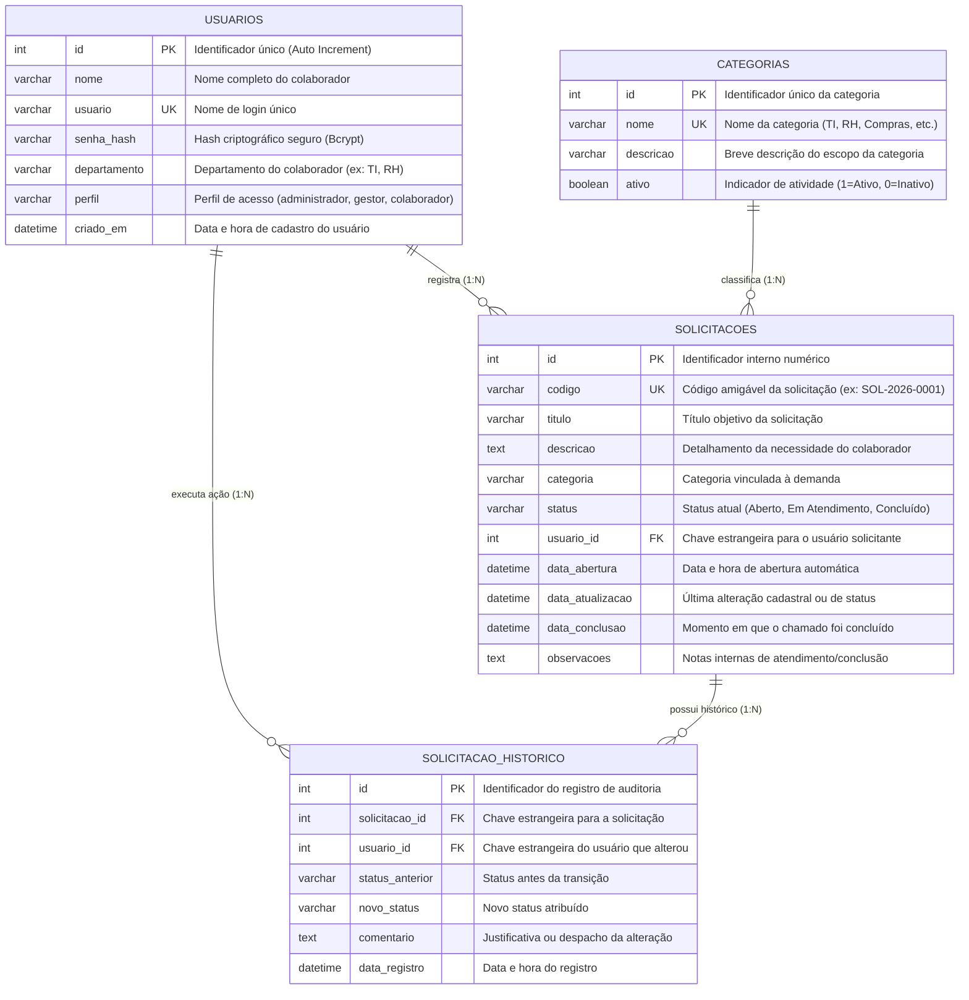
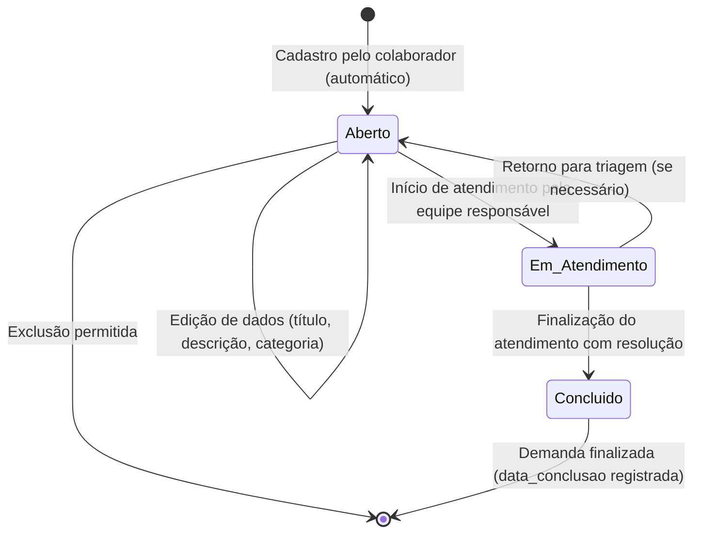

# Dicionário de Dados — Portal de Solicitações Internas
**bit Soluções — Processo Seletivo Desenvolvedor(a) de Sistemas Júnior**

Este documento detalha o modelo relacional de dados do sistema, especificando entidades, atributos, tipos de dados, chaves primárias e estrangeiras, restrições de integridade, índices de desempenho e diagramas explicativos.

---

## 1. Diagrama Entidade-Relacionamento (DER)

---

## 2. Detalhamento das Tabelas

### 2.1. Tabela: `usuarios`
Armazena as informações dos colaboradores e gestores com credenciais para autenticação e auditoria de ações no sistema.

| Coluna | Tipo SQL | Nulo? | Chave | Valor Padrão | Descrição |
| :--- | :--- | :---: | :---: | :--- | :--- |
| `id` | INTEGER | Não | **PK** | AUTO_INCREMENT | Identificador numérico único do usuário. |
| `nome` | VARCHAR(100) | Não | - | - | Nome completo do colaborador. |
| `usuario` | VARCHAR(50) | Não | **UK** | - | Login único utilizado para acesso ao sistema. |
| `senha_hash` | VARCHAR(255) | Não | - | - | Hash da senha gerado com algoritmo Bcrypt (custo 10). |
| `departamento`| VARCHAR(50) | Não | - | - | Setor de lotação (ex: TI, RH, Financeiro, Compras). |
| `perfil` | VARCHAR(20) | Não | - | `'colaborador'`| Nível de permissão: `administrador`, `gestor` ou `colaborador`. |
| `criado_em` | DATETIME | Sim | - | `CURRENT_TIMESTAMP` | Data e hora em que a conta foi criada. |

**Regras de Integridade e Validação:**
- O campo `usuario` deve ser único em toda a base de dados.
- O campo `senha_hash` nunca armazena senhas em texto puro.
- O campo `perfil` possui validação CHECK: `('administrador', 'gestor', 'colaborador')`.

---

### 2.2. Tabela: `categorias`
Armazena a relação de departamentos e temas disponíveis para abertura de chamados.

| Coluna | Tipo SQL | Nulo? | Chave | Valor Padrão | Descrição |
| :--- | :--- | :---: | :---: | :--- | :--- |
| `id` | INTEGER | Não | **PK** | AUTO_INCREMENT | Identificador sequencial da categoria. |
| `nome` | VARCHAR(50) | Não | **UK** | - | Nome da categoria (ex: TI, RH, Compras, Financeiro, Infraestrutura). |
| `descricao` | VARCHAR(200) | Sim | - | NULL | Explicação do tipo de atendimento contemplado. |
| `ativo` | BOOLEAN | Não | - | `1` (true) | Determina se a categoria está disponível para seleção. |

---

### 2.3. Tabela: `solicitacoes`
Entidade central do sistema, responsável por registrar os chamados cadastrados pelos colaboradores e seu ciclo de vida.

| Coluna | Tipo SQL | Nulo? | Chave | Valor Padrão | Descrição |
| :--- | :--- | :---: | :---: | :--- | :--- |
| `id` | INTEGER | Não | **PK** | AUTO_INCREMENT | Identificador interno da solicitação. |
| `codigo` | VARCHAR(20) | Não | **UK** | - | Código legível de protocolo (ex: `SOL-2026-0001`). |
| `titulo` | VARCHAR(150) | Não | - | - | Resumo claro e objetivo da necessidade. |
| `descricao` | TEXT | Não | - | - | Detalhamento completo da solicitação do colaborador. |
| `categoria` | VARCHAR(50) | Não | - | - | Categoria do serviço solicitado. |
| `status` | VARCHAR(30) | Não | - | `'Aberto'` | Estado atual do chamado (`Aberto`, `Em Atendimento`, `Concluído`). |
| `usuario_id` | INTEGER | Não | **FK** | - | Identificador do usuário que abriu a solicitação (`usuarios.id`). |
| `data_abertura` | DATETIME | Sim | - | `CURRENT_TIMESTAMP` | Registro temporal automático de abertura. |
| `data_atualizacao`| DATETIME| Sim | - | `CURRENT_TIMESTAMP` | Data e hora da última modificação cadastral ou de status. |
| `data_conclusao`| DATETIME | Sim | - | NULL | Preenchido automaticamente na transição para `'Concluído'`. |
| `observacoes` | TEXT | Sim | - | NULL | Parecer do atendimento técnico ou motivo de finalização. |

**Regras de Negócio Associadas:**
1. **Status Inicial Obrigatório:** Toda nova solicitação é inicializada compulsoriamente com o status `'Aberto'`.
2. **Edição e Exclusão Condicionais:** Conforme especificação funcional do edital, **apenas solicitações com status `'Aberto'` podem ser editadas ou excluídas**. Uma solicitação em atendimento ou concluída tem seu conteúdo protegido contra modificação ou exclusão indevida.
3. **Auditoria de Conclusão:** Quando o status é alterado para `'Concluído'`, a coluna `data_conclusao` é preenchida automaticamente com o timestamp da transação.

---

### 2.4. Tabela: `solicitacao_historico`
Tabela de auditoria responsável por rastrear a linha do tempo de alterações de status e despachos dos chamados.

| Coluna | Tipo SQL | Nulo? | Chave | Valor Padrão | Descrição |
| :--- | :--- | :---: | :---: | :--- | :--- |
| `id` | INTEGER | Não | **PK** | AUTO_INCREMENT | Identificador único do registro de histórico. |
| `solicitacao_id`| INTEGER | Não | **FK** | - | Referência à solicitação (`solicitacoes.id`). |
| `usuario_id` | INTEGER | Não | **FK** | - | Colaborador/Gestor que efetuou a alteração (`usuarios.id`). |
| `status_anterior`| VARCHAR(30)| Sim| - | NULL | Status do chamado antes da transição. |
| `novo_status` | VARCHAR(30) | Não | - | - | Novo status atribuído à solicitação. |
| `comentario` | TEXT | Sim | - | NULL | Nota explicativa ou justificativa da movimentação. |
| `data_registro` | DATETIME | Sim | - | `CURRENT_TIMESTAMP` | Momento exato da transição. |

---

## 3. Máquina de Estados da Solicitação

---

## 4. Índices e Estratégia de Otimização

Para assegurar consultas de alta performance nas buscas, filtros e métricas do dashboard, foram definidos os seguintes índices secundários:

| Nome do Índice | Tabela | Coluna(s) Indexada(s) | Finalidade Técnica |
| :--- | :--- | :--- | :--- |
| `idx_solicitacoes_status` | `solicitacoes` | `status` | Agiliza contagem do dashboard e filtros por status (`Aberto`, `Em Atendimento`, `Concluído`). |
| `idx_solicitacoes_categoria` | `solicitacoes` | `categoria` | Otimiza consultas filtradas pelo departamento requisitado. |
| `idx_solicitacoes_data_abertura`| `solicitacoes` | `data_abertura` | Acelera buscas por intervalo temporal (`data_inicio` a `data_fim`). |
| `idx_solicitacoes_codigo` | `solicitacoes` | `codigo` | Busca pontual ultrarrápida pelo código do protocolo. |
| `idx_solicitacoes_titulo` | `solicitacoes` | `titulo` | Otimiza pesquisas textuais parciais (`LIKE %termo%`). |
| `idx_solicitacoes_usuario_id` | `solicitacoes` | `usuario_id` | Otimiza a junção (`JOIN`) entre solicitações e usuários solicitantes. |
| `idx_historico_solicitacao_id`| `solicitacao_historico` | `solicitacao_id` | Garante recuperação imediata da timeline de atendimento de um chamado. |
